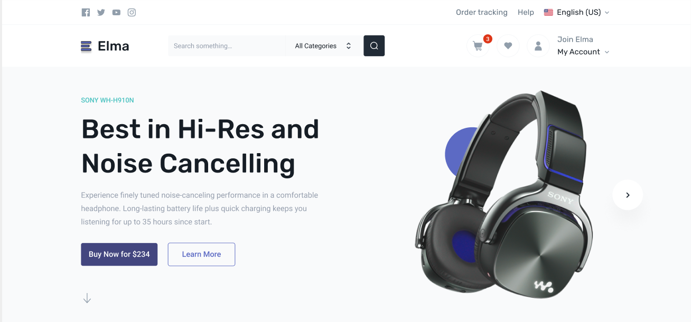
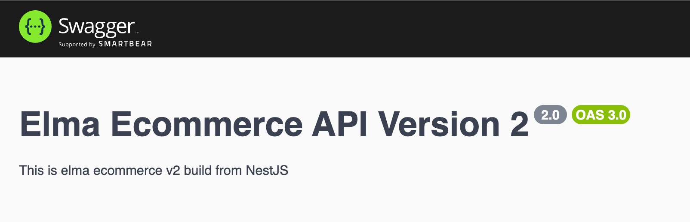

<div align="center">

<div>
    
    
    
    
    
    
    
  </div>

  <h3 align="center">An E-commerce Platform</h3>

   
</div>

## Table of contents
- [Table of contents](#table-of-contents)
- [Introduction](#introduction)
- [Tech Stack](#tech-stack)
- [Features](#features)
- [Quick Start](#quick-start)
- [More](#more)

## <a name="introduction">Introduction</a>
This project is a production-ready E-commerce System built with React and TypeScript.

 
## <a name="tech-stack">Tech Stack</a>
- React
- Tailwindcss
- Zustand
- Antd Design
- Typescript
- Vite
- PNPM
- I18n

## <a name="features">Features</a>

## <a name="quick-start">Quick Start</a>
Follow these steps to set up the project locally on your machine.

**Prerequisites**

Make sure you have the following installed on your machine:

- [Git](https://git-scm.com/)
- [Node.js](https://nodejs.org/en)
- [npm](https://www.npmjs.com/) (Node Package Manager)
- [pnpm](https://pnpm.io/) (Performance NPM)

**Cloning the Repository**

```bash
git clone https://github.com/lecaotanloc289/fe-elma-v2.git
cd fe-elma-v2
```

**Installation**

Install the project dependencies using npm:

```bash
pnpm install
```

**Set Up Environment Variables**

Create a new file named `.env` in the root of your project and add the following content:

```env
#BACKEND BASE URL
BASE_URL=
```

**Running the Project**

```bash
pnpm run start:dev
```

Open [http://localhost:5173](http://localhost:5173) in your browser or any HTTP client to test the project.


## <a name="more">More</a>
<a href="">

 </a>
